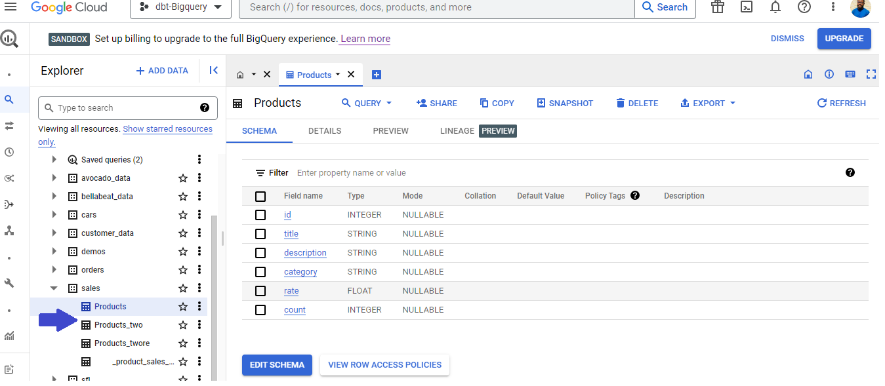

## USING JAVA SDK FOR SEAMLESS ELT TO BIGQUERY AND VISUALIZATION ON LOOKER
**_Author:_ _Victor Iwuoha (Data Engineering & Analytics Professional)_**


### Introduction
In this tutorial, you will learn how to perform **Extract, Transform** and **Load** (ETL) operations to Google BigQuery using Java. 
We will be extracting data from an API endpoint in JSON format, transforming the data to tabular format, and finally loading the transformed data to BigQuery,
using Java. As an End-to-End Analytics Pipeline, we would also **Visualize** our Data in Looker Studio.

### Project Workflow


### Prerequisites
Before we begin, ensure that you have the following:

- A Google Cloud Platform account with billing enabled or the BigQuery **SandBox**
- A project created on the Google Cloud Console and the appropriate APIs enabled
- [A Service Account with access to the BigQuery API ](https://cloud.google.com/bigquery/docs/quickstarts/quickstart-client-libraries)
( Also, download the Json File Key)
- Java 19 installed on your computer
- Any IDE of Your Choice (Eg; Intellij IDEA)
- A clone of this repository or a Java Project

### Requirements/ Environment Setup

1. Dependencies: The class uses the following dependencies:

- `com.google.cloud.bigquery`
- `com.google.gson`
- `com.opencsv`

 You can paste the following in a pom.xml file to build in the dependencies or use their respective Maven Repositories.

```` pom.xml
<dependencies>
    <dependency>
        <groupId>com.google.cloud</groupId>
        <artifactId>google-cloud-bigquery</artifactId>
        <version>2.3.3</version>
    </dependency>
    <dependency>
        <groupId>com.google.code.gson</groupId>
        <artifactId>gson</artifactId>
        <version>2.8.9</version>
    </dependency>
    <dependency>
        <groupId>com.opencsv</groupId>
        <artifactId>opencsv</artifactId>
        <version>5.5.1</version>
    </dependency>
</dependencies>
````

2. Add an ENVIRONMENT variable named GOOGLE_APPLICATION_CREDENTIALS pointing to the path of your earlier downloaded service account keys.
In Intellij simply go to Run/Edit Configurations and add this.

3. Create a folder named **xtracts/** within your project. This is where our data would be staged at the bronze and
   silver level of transformation. You can also use the GCS SDK to write these datasets to a GCS Bucket.
   
**Note :** _At a higher level, you can create a [**Cloud Function**](https://cloud.google.com/functions) on GCP that gets triggered to run the **Main Class** of this project
   when the bucket is updated with a JSON/CSV file and have the filename/object path returned from this event 
   as an input argument for the DataTransformer.transformAndLoad method. 
See [How to get path to uploaded GCS file](https://stackoverflow.com/questions/57885334/how-to-check-which-path-the-file-landed-in-cloud-storage-folders-using-cloud-fun)
for more info._

### **Steps**
The Workings of this DataTransformer class are synonymous with Steps 1 - 6 of the workflow diagram above.

- Extract data in JSON format from an API endpoint
- Store the data in a JSON file
- Transform the data to tabular format and store in a CSV file
- Load the data from the CSV file to a BigQuery table

The steps above are handled by the three public methods of the [**DataTransformer**](src/DataTransformer.java) Class.
Let us discuss these methods in detail.

#### **Step 1 : Extract Data from a REST API and Load to File Storage**

- **getRuntime:** is a private helper method that returns the current date and time as a string which is later appended to file names.
````
private static String getRuntime() {
    SimpleDateFormat formatter = new SimpleDateFormat("yyyy_MM_dd_HH_mm_ss");
    Date date = new Date();
    return formatter.format(date);
    }
````

- **_getAndLoadData(String apiEndpoint)_ :** This method **extracts** data from an API endpoint and stores it in a JSON file.
it takes in the API endpoint URL as a parameter. This method uses the `HttpClient` class to send an
HTTP request to the API endpoint and receives the response in JSON format. 
The response is then saved to a file using the `FileWriter` class.
In this case, an open-source API called [Fake Store API](https://fakestoreapi.com/products) is used.


#### **Step 2: Transform Data**

- **_transformData(String filePath)_ :**
This method transforms your JSON file's data into a tabular structure for a CSV file.
The data in the JSON file is read into a buffer using a `Reader` and then converted to a jsonArray using the `gson.fromJson()`
Data from this Array is iterated over, transformed and written into an ArrayList. This arraylist is then written
to file storage using the `CSVWriter` with information on the date and time of execution. If the path is inaccessible,
an **IOException** is raised.

**Note:**
_This can also be written to [**GCS**](https://cloud.google.com/storage)/ [**S3**](https://aws.amazon.com/s3/)
depending on your implementation._
_This can be modified to be more dynamic instead of a hard-coded ArrayList to store data_.


#### **Step 3 : Load Data To BigQuery**
In data analytics & engineering workloads, a [**Data Warehouse**](https://en.wikipedia.org/wiki/Data_warehouse) 
is mostly the final landing zone for transformed data which would be used in downstream analytics/ business intelligence / data applications.
Data warehouses like [**Google Bigquery**](https://cloud.google.com/bigquery) are highly efficient and scalable for this purpose.

- _**loadCsvToBigQuery(String datasetName, String tableName, String sourceUri)**_: 
This method loads the data from a sourceUri (which is the URI to the CSV file on local storage or on GCS/S3.)
to a BigQuery table within a specified dataset in the project which
exists on bigquery. The BigQuery class from the `com.google.cloud.bigquery.*` library is 
used to interact with the BigQuery API by creating a `TableDataWriteChannel` to write data to BigQuery. 

**Note:** 
_The table will be created if it does not already exist or data would be appended to if it does. The Schema of
the csv file is also [**automatically inferred**](https://cloud.google.com/bigquery/docs/schema-detect),
but you can [**define a specific schema**](https://cloud.google.com/bigquery/docs/schemas)._


#### **Step 4 : Execution and Validation**

Now that You understand the Working of our DataTransformer Class , you can now Instantiate it and call its methods
from within your **Main.java** file as follows;

````
public class Main {

    public static void main(String[] args) throws IOException, InterruptedException {
        DataTransformer EltTransformer = new DataTransformer();
        String rawFilePath = EltTransformer.getAndLoadData("https://fakestoreapi.com/products");
        String transformedFilePath = EltTransformer.transformData(rawFilePath);
        EltTransformer.loadCsvToBigQuery("sales", "Products", transformedFilePath);}}
    }
}
````

If the above runs successfully, you should an output similar to the following in your terminal.


Going to the Bigquery UI you should be able to see your Table Created as follows;



#### Bonus Step : Data Analytics and Visualization

If You are Familiar with SQL , then running the following SQL query on the Bigquery UI would show you the ingested data.

The Syntax is :
````sql 
SELECT * 
FROM yourProjectID.yourDatasetName.yourTableName
````


- Above on **#1** we can see that our 20 rows of E-Commerce Data were loaded into our data warehouse.
- By clicking **Explore Data** as shown in **#2**, we can navigate to **Looker Studio** 
to perform a quick visual Exploratory Data Analysis (EDA) on the dataset we ingested. 
[**Looker Studio**](https://lookerstudio.google.com/overview) is a blend of a data platform formerly known as 
Looker and Google Data Studio after [**Google acquired it**](https://techcrunch.com/2020/02/13/google-closes-2-6b-looker-acquisition/) in 2019. 
It is useful for **Data Analysts** and **Business Intelligence developers** in creating **dashboards that give business insights and aid reporting** too. 
The dashboard below was created using **Looker Studio**. Feel free to create your own custom dashboard.


- On Looker, you can also automate your reports to be sent out [**on a schedule**](https://support.google.com/looker-studio/answer/9263641?hl=en&ref_topic=7442437#zippy=%2Cin-this-article)
  to relevant stakeholders. As one who has worked as a data analyst, this comes in handy for various needs of management
  and stakeholders that are data related.

### **Basic Insights from Dashboard** 

- It is evident that out of the top 10 highest rated products, 40% are Electronics,
40 % are Women's Clothing and the remaining 20% are Men's clothing .
- Men and Women's clothing categories are equally rated by the business's customers.
- Although the highest number of items on the website are Electronics, it's rating in slightly lower than the Clothing
categories.
- Average rating on Jewelry Items at this E-commerce business is low and none of them made the top 10 list. Since
Jewelries are not as frequently purchased as clothing this business may need to review their quality, packaging,
customer service or delivery for Jewelries.

### **Applications of This Java Class**

- **Storage Application Backend Service :**
  If you build a SaaS platform for Data Storage that uses GCS/BigQuery as a backend abstracted from your end-users
  You can use this logic in your script.
- ETL/ELT for Java Developers. If your engineering team is already conversant with Java, they can build some good Data Engineering
solutions on GCP using the [**Java SDK**](https://cloud.google.com/java/docs/reference). 
However, you would mostly Find Python as a more flexible and more popular option 
for Data Engineering workloads. 
- It is also notable that most cloud platforms such as **Azure, GCP and AWS** have SDK's in multiple programming languages built for
interacting with their services.

If you enjoyed this Project or have any comments/ questions, Let's connect on Linkedin [@viciwuoha](https://linkedin.com/in/VICIWUOHA)